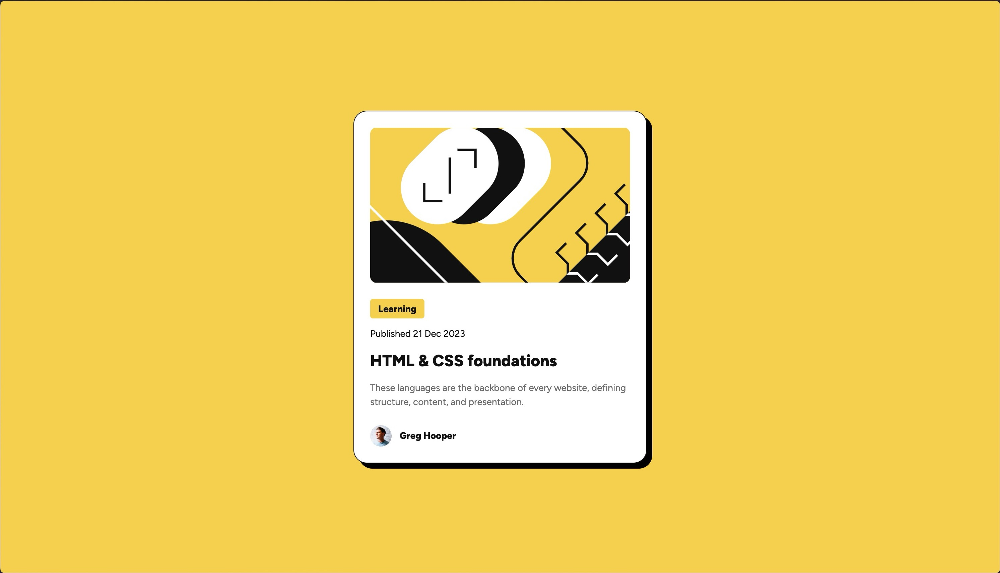

# Frontend Mentor - Blog preview card solution

This is a solution to the [Blog preview card challenge on Frontend Mentor](https://www.frontendmentor.io/challenges/blog-preview-card-ckPaj01IcS). Frontend Mentor challenges help you improve your coding skills by building realistic projects.

## Table of contents

- [Screenshot](#screenshot)
- [Links](#links)
- [Built with](#built-with)
- [What I learned](#what-i-learned)
- [Continued development](#continued-development)
- [Author](#author)

### Screenshot

### Links

- Solution URL: [GitHub](https://github.com/galonaranjo/practice-blog-card)
- Live Site URL: [Vercel](https://practice-blog-card.vercel.app/)

### Built with

- Semantic HTML5 markup
- CSS custom properties
- Flexbox

### What I learned

I learned more about resetting my stylesheet. With each project I'm slowly refining initial properties to my liking.

### Continued development

I want to continue learning and refining my layout skills. Right now I rely mostly on flexbox, but would like to learn grids for when it'd be most applicable.

## Author

- Website - [Galo Naranjo](https://github.com/galonaranjo)
- Frontend Mentor - [@galonaranjo](https://www.frontendmentor.io/profile/galonaranjo)
- Twitter - [@galonaranjo\_](https://www.twitter.com/galonaranjo_)
